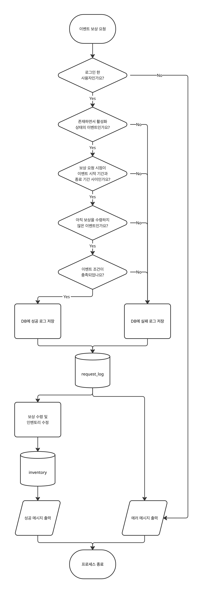

# MAPLESTORY 백엔드 과제

## 🚀 실행 방법

1. 저장소 클론
   ```bash
   git clone https://github.com/youmin29/HW-MAPLESTORY.git
   cd HW-MAPLESTORY
   ```
2. 환경 변수 설정  
   ` .env.example` 파일을 참고해서 `.env` 파일 작성
3. docker-compose 실행 (또는 로컬 실행 방법)
   ```bash
   docker-compose up --build
   ```
4. API 서버 접속  
   기본 URL: `http://localhost:3000`

---

## 📊 ERD 및 API 문서

- ERD 다이어그램
    
  [ERD 다이어그램 바로가기](https://www.dbdiagram.io/d/HW-MAPLESTORY-6824347d5b2fc4582f8254b3)

- Postman API 문서  
  [Postman API 문서 바로가기](https://www.postman.com/youmin29/hw-maplestory/documentation/80y09ux/maplestory)

- Swagger API 문서  
    
  서버 실행 후, [http://localhost:3000/api-docs](http://localhost:3000/api-docs) 에 접속하면  
  Swagger UI를 통해 API 문서를 직관적으로 확인할 수 있습니다.

---

<span id="target-section"></span>

## 🔍 조건 검증 방식

- **조건 검증 순서**

  1. 사용자 자격 검증
  2. 이벤트 존재 검증
  3. 이벤트 기간 체크
  4. 보상 수령 여부 검증
  5. 이벤트 조건별 상세 검증 (예: 출석, 구매 금액 등)

- **설명**  
조건 검증은 위와 같은 단계로 진행되며, 아래의 순서도 이미지를 참고해 주세요.
   <details>
     <summary>순서도 이미지 보기</summary>
     
   </details>

---

## 🎯 이벤트 조건 종류 및 예시

| 이벤트 조건 종류 | 설명                                              | 예시                   |
| ---------------- | ------------------------------------------------- | ---------------------- |
| 출석 이벤트      | 사용자가 일정 기간 출석 시 보상 지급              | 7일 연속 출석          |
| 아이템 이벤트    | 인벤토리에 특정 아이템 n개 이상 보유 시 보상 지급 | 주황버섯의 갓 5개 보유 |

> ---
>
> ### 💡 하나의 이벤트는 여러 조건을 가질 수 있습니다.
>
> ---
>
> **✅ 예시 1**  
> 🔹 3일 연속 출석  
> 🔹 주황버섯의 갓 10개 보유
>
> ---
>
> **✅ 예시 2**  
> 🔹 씨클의 세포샘플 1개 보유  
> 🔹 씨코의 세포샘플 1개 보유  
> 🔹 핀붐의 세포샘플 1개 보유
>
> ---

---

## 🎁 보상 아이템 종류 및 예시

| 보상 아이템 종류 | 설명           | 예시                      |
| ---------------- | -------------- | ------------------------- |
| 아이템           | 게임 내 아이템 | 15분 경험치 2배 쿠폰 10개 |

_`item` 컬렉션에 저장된 모든 아이템을 보상으로 선택할 수 있습니다._

> ---
>
> ### 💡 하나의 이벤트는 여러 보상을 가질 수 있습니다.
>
> ---
>
> **✅ 예시**  
> 🔹 자수정 귀고리 1개  
> 🔹 옐로우 스퀘어 1개
>
> ---

---

## 📌 핵심 데이터베이스 설계 의도

#### 📁 `event_condition`

- 하나의 이벤트가 여러 개의 조건을 가질 수 있도록 분리된 컬렉션입니다.
- 조건의 종류(출석, 아이템 보유)에 따라 다양한 형태의 이벤트를 지원할 수 있습니다.

#### 📁 `event_reward`

- 하나의 이벤트에 여러 보상을 부여할 수 있도록 구성된 컬렉션입니다.

#### 📁 `event_group`

- 여러 이벤트를 하나의 그룹으로 묶어 관리합니다.
- **메이플스토리 이벤트 퀘스트 구조**에서 착안해, `[이벤트명] 퀘스트명`의 표현을 위한 설계입니다.
- `group_id`를 지정하지 않으면 단일 이벤트로 취급됩니다.
- <details>
    <summary>관련 이미지 보기</summary>
    
  </details>

#### 📁 `item`, `inventory`, `attendance_log`

- 다양한 이벤트 조건 처리를 위한 핵심 컬렉션입니다.

| 컬렉션           | 역할                                            |
| ---------------- | ----------------------------------------------- |
| `item`           | 이벤트 조건 또는 보상 아이템 목록을 정의합니다. |
| `inventory`      | 유저가 가진 아이템 정보를 저장합니다.           |
| `attendance_log` | 유저의 출석 기록을 저장합니다.                  |

- 출석 이벤트 및 아이템 수집 이벤트에서 활용됩니다.
- 보상 지급 시, `inventory`에 직접 반영됩니다.

#### 📁 `request_log`

- 이벤트 보상 요청 시 로그가 저장되는 컬렉션입니다.
- 요청 처리 과정에서 조건 검증 결과를 Boolean 값으로 기록해 성공 여부를 명확하게 추적할 수 있습니다.
- 보상 수령이 실패할 경우, 실패 원인을 로그에 저장해 원인 분석이 가능하도록 구현했습니다.

---

## ⚙️ 주요 비즈니스 로직

#### 🔑 이벤트 정보 조회 API

- `ADMIN` 역할은 모든 이벤트를 조회할 수 있어 전체 이벤트를 관리할 수 있습니다.
- 기타 역할은 이벤트 기간 내의 퀘스트만 조회할 수 있도록 제한됩니다.
- 일반 퀘스트가 아닌 **이벤트 퀘스트**에서는 특정 아이콘을 클릭하면 **현재 진행 중인(기간 내) 퀘스트만** 표시되는 부분을 반영했습니다.
- <details>
    <summary>관련 이미지 보기</summary>
    
  </details>

#### 🔑 이벤트 보상 요청 API

- 사용자는 <a href="#target-section">**총 5가지 분기를 통과**</a>할 경우, 보상을 수령할 수 있습니다.
- 성공/실패와 관계 없이 모든 로그가 데이터베이스에 기록되며, 이후 조회 가능합니다.
- 이밴트 조건을 모두 충족한 경우, `inventory`에 아이템 보상이 자동으로 지급됩니다.
- 이벤트 조건에 아이템이 포함된 경우, 해당 아이템은 `inventory`에서 **필요한 수량만큼 자동으로 차감**됩니다.

#### 🔑 이벤트 그룹 삭제 API

- 이벤트 그룹 삭제 시 `http://localhost:3000/event/group/{id}?cascade=true`와 같이 `cascade=true`를 Query Parameter를 추가하면, **그룹 내 하위 이벤트도 함께 삭제**됩니다.
- 기본 설정(`cascade=false`)에서는 그룹만 제거되며, **하위 이벤트는 유지**되고 그룹이 없는 단일 퀘스트로 수정됩니다.

#### 🔑 출석 체크 API

- 게임 내 **데일리 기프트**에서 영감을 받아, 로그인 시 자동 기록이 아닌 API 호출을 통한 로그 저장 방식으로 설계했습니다.
- 하루에 한 번만 출석할 수 있으며, 해당 데이터를 활용해 출석 이벤트 조건을 검증합니다.
- <details>
    <summary>관련 이미지 보기</summary>
    
  </details>

---

## 🛠️ 추가 참고사항

- 사용된 주요 기술 스택

  - NestJS, MongoDB, Mongoose
  - Docker, Docker Compose

---

**작성자**: 이유민  
**작성일**: 2025-05-20
